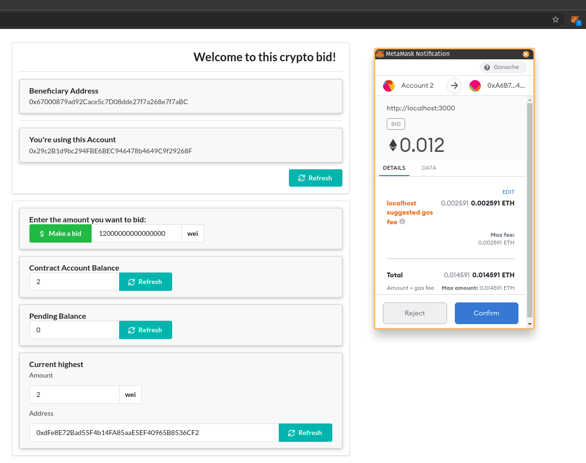

# UI Implementation for [Solidity Course Final Project](https://github.com/torrescristian/solidity-course-final-project)

# Pending Features or Tasks
- [] Display the auction end time
- [] Publish the smart contract to the Ethereum Main Net
- [] Publish the UI to Github Pages
- [] Improve the smart contract to allow to create new bids from UI

# Preview

